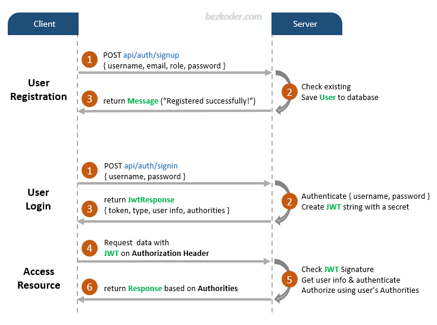

# Spring Boot JWT Authentication example with Spring Security & Spring Data JPA

## User Registration, User Login and Authorization process.
The diagram shows flow of how we implement User Registration, User Login and Authorization process.



## Spring Boot Server Architecture with Spring Security
You can have an overview of our Spring Boot Server with the diagram below:


## Dependency
– If you want to use PostgreSQL:
```xml
<dependency>
  <groupId>org.postgresql</groupId>
  <artifactId>postgresql</artifactId>
  <scope>runtime</scope>
</dependency>
```
– or MySQL:
```xml
<dependency>
  <groupId>mysql</groupId>
  <artifactId>mysql-connector-java</artifactId>
  <scope>runtime</scope>
</dependency>
```
– or H2:
```xml
<dependency>
    <groupId>com.h2database</groupId>
    <artifactId>h2</artifactId>
    <scope>runtime</scope>
</dependency>
```
## Configure Spring Datasource, JPA, App properties
Open `src/main/resources/application.properties`
- For PostgreSQL:
```
spring.datasource.url= jdbc:postgresql://localhost:5432/testdb
spring.datasource.username= your_username
spring.datasource.password= your_password

spring.jpa.properties.hibernate.jdbc.lob.non_contextual_creation= true
spring.jpa.properties.hibernate.dialect= org.hibernate.dialect.PostgreSQLDialect

# Hibernate ddl auto (create, create-drop, validate, update)
spring.jpa.hibernate.ddl-auto= update
server.port=8090

# App Properties
gnilapon.anywr.group.app.jwtSecret= gnilaponSecretKey
gnilapon.anywr.group.app.jwtExpirationMs= 86400000
```
- For MySQL
```
spring.datasource.url= jdbc:mysql://localhost:3306/testdb?useSSL=false
spring.datasource.username= your_username
spring.datasource.password= your_password

spring.jpa.properties.hibernate.dialect= org.hibernate.dialect.MySQL5InnoDBDialect
spring.jpa.hibernate.ddl-auto= update
server.port=8090

```
- For H2
```
spring.datasource.url=jdbc:h2:mem:handler
spring.datasource.driverClassName=org.h2.Driver
spring.datasource.username=sa
spring.datasource.password=sa
spring.jpa.database-platform=org.hibernate.dialect.H2Dialect
server.port=8090

# App Properties
gnilapon.anywr.group.app.jwtSecret= gnilaponSecretKey
gnilapon.anywr.group.app.jwtExpirationMs= 86400000
```
## Run Spring Boot application
```
mvn clean install
mvn spring-boot:run
```
## Swagger documentation
```
http://localhost:8090/swagger-ui/index.html
```
## H2 management
```
http://localhost:8090/h2-console
```
